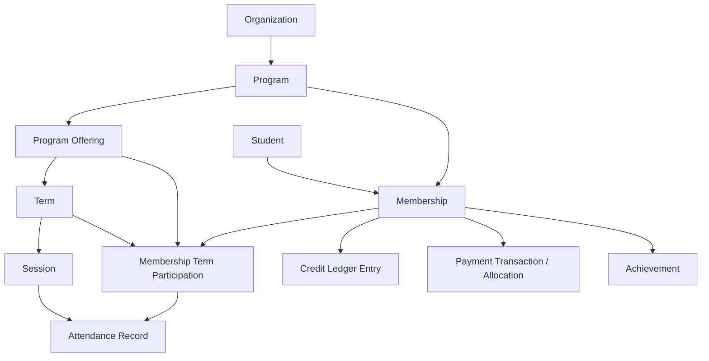
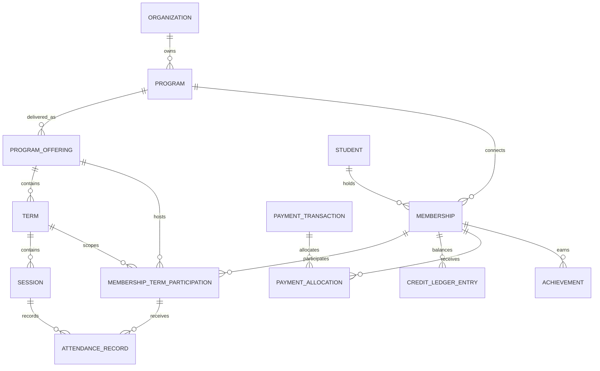
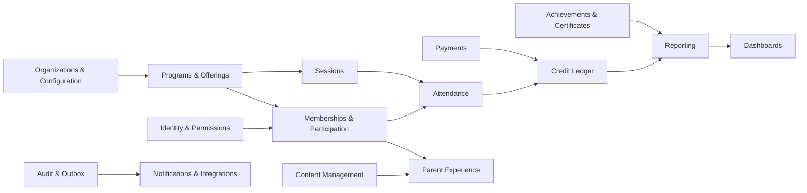

# Domain, ERD, and Module Diagrams

## Domain Model

```mermaid
flowchart TD
  O["Organization"] --> P["Program"]
  P --> OF["Program Offering"]
  OF --> T["Term"]
  T --> S["Session"]
  ST["Student"] --> M["Membership"]
  P --> M
  M --> MTP["Membership Term Participation"]
  OF --> MTP
  T --> MTP
  MTP --> A["Attendance Record"]
  S --> A
  M --> CL["Credit Ledger Entry"]
  M --> PT["Payment Transaction / Allocation"]
  M --> ACH["Achievement"]
```

## Entity Relationship Diagram

```mermaid
erDiagram
  ORGANIZATION ||--o{ PROGRAM : owns
  PROGRAM ||--o{ PROGRAM_OFFERING : delivered_as
  PROGRAM_OFFERING ||--o{ TERM : contains
  TERM ||--o{ SESSION : contains
  STUDENT ||--o{ MEMBERSHIP : holds
  PROGRAM ||--o{ MEMBERSHIP : connects
  MEMBERSHIP ||--o{ MEMBERSHIP_TERM_PARTICIPATION : participates
  PROGRAM_OFFERING ||--o{ MEMBERSHIP_TERM_PARTICIPATION : hosts
  TERM ||--o{ MEMBERSHIP_TERM_PARTICIPATION : scopes
  SESSION ||--o{ ATTENDANCE_RECORD : records
  MEMBERSHIP_TERM_PARTICIPATION ||--o{ ATTENDANCE_RECORD : receives
  MEMBERSHIP ||--o{ CREDIT_LEDGER_ENTRY : balances
  PAYMENT_TRANSACTION ||--o{ PAYMENT_ALLOCATION : allocates
  MEMBERSHIP ||--o{ PAYMENT_ALLOCATION : receives
  MEMBERSHIP ||--o{ ACHIEVEMENT : earns
```

## Module Dependency Diagram

```mermaid
flowchart LR
  Identity["Identity & Permissions"] --> Memberships
  Organizations["Organizations & Configuration"] --> Programs
  Programs["Programs & Offerings"] --> Memberships
  Programs --> Sessions
  Memberships["Memberships & Participation"] --> Attendance
  Sessions["Sessions"] --> Attendance
  Attendance["Attendance"] --> Credits
  Payments["Payments"] --> Credits
  Credits["Credit Ledger"] --> Reporting
  Content["Content Management"] --> ParentExperience["Parent Experience"]
  Memberships --> ParentExperience
  Achievements["Achievements & Certificates"] --> Reporting
  Audit["Audit & Outbox"] --> Notifications["Notifications & Integrations"]
  Reporting["Reporting"] --> Dashboards["Dashboards"]
```
